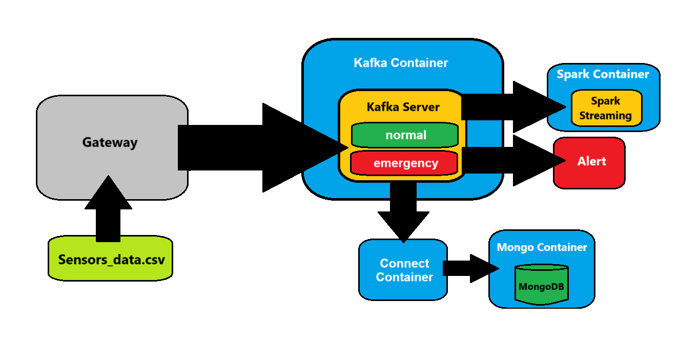

# IoT Patient Monitoring Pipeline

A real-time patient monitoring system built with Apache Kafka, MongoDB, and Apache Spark Streaming. The system processes IoT medical device data, identifies emergency situations, and stores both normal and emergency readings for analysis.

## Architecture Overview

The pipeline consists of several components:
- **Kafka**: Message broker for data ingestion and streaming
- **MongoDB**: Data storage for normal and emergency readings
- **Spark Streaming**: Real-time data processing and analytics
- **Kafka Connect**: Integration between Kafka and MongoDB
- **Control Center**: Kafka monitoring and management interface



## Project Structure
```
/
├── spark-streaming/
│   └── streaming.py          # Spark streaming analytics
├── alert.py                  # Emergency alerts consumer
├── createKafkaTopic.py      # Kafka topic creation script
├── docker-compose.yml        # Docker services configuration
├── Dockerfile               # Kafka Connect with MongoDB connector
├── gateway.py               # Data producer/simulator
├── iot_patient_data.csv     # Sample dataset
├── mongo.py                 # MongoDB data viewer
├── requirements.txt         # Python dependencies
├── sink_emergency.json      # MongoDB connector config for emergencies
└── sink_normal.json         # MongoDB connector config for normal readings
```

## Dataset Description

The dataset contains IoT medical monitoring data with the following fields:
- **Timestamp**: Reading time
- **PatientID** (P1-P10): Unique patient identifier
- **DeviceID** (D1-D5): Monitoring device identifier
- **Metric**: Vital sign being measured (Temperature, HeartRate, OxygenLevel)
- **Value**: Numerical measurement
- **Unit**: Measurement unit (°C, bpm, %)

## Emergency Thresholds

The system monitors for the following emergency conditions:
- Temperature > 39°C
- Heart Rate > 120 bpm
- Oxygen Level < 90%

## System Requirements

- Python 3.11
- Docker and Docker Compose
- 8GB RAM (minimum)
- 20GB free disk space

## Installation and Setup

1. Create a Python virtual environment:
```bash
python -m venv venv
```

2. Activate the virtual environment:
```bash
# Windows
.\venv\Scripts\activate

# Linux/MacOS
source venv/bin/activate
```

3. Install Python dependencies:
```bash
pip install -r requirements.txt
```

4. Start the Docker containers:
```bash
docker-compose up -d --build
```

5. Create Kafka topics:
```bash
python createKafkaTopic.py
```

## Running the Pipeline

1. Start the data producer:
```bash
python gateway.py
```

2. Start the alert monitoring system:
```bash
python alert.py
```

3. Configure MongoDB connectors:
```bash
# Windows
Invoke-RestMethod -Uri "http://localhost:8083/connectors" -Method POST -ContentType "application/json" -Body (Get-Content -Raw sink_emergency.json)
Invoke-RestMethod -Uri "http://localhost:8083/connectors" -Method POST -ContentType "application/json" -Body (Get-Content -Raw sink_normal.json)

# Linux/MacOS
curl -X POST -H "Content-Type: application/json" --data @sink_emergency.json http://localhost:8083/connectors
curl -X POST -H "Content-Type: application/json" --data @sink_normal.json http://localhost:8083/connectors
```

4. Start Spark streaming analytics:
```bash
docker exec -it Spark-submit /opt/bitnami/spark/bin/spark-submit \
    --master spark://spark-master:7077 \
    --packages org.apache.spark:spark-sql-kafka-0-10_2.12:3.3.0 \
    /app/streaming.py
```

## Accessing Components

- **Kafka Control Center**: http://localhost:9021
- **Spark Master UI**: http://localhost:8080
- **MongoDB**: localhost:27017
- **Kafka Connect REST API**: http://localhost:8083

## Monitoring and Management

1. View data in MongoDB:
```bash
python mongo.py
```

2. Monitor Kafka topics and connectors through Control Center:
   - Navigate to http://localhost:9021
   - Check topic health, throughput, and consumer groups

3. Monitor Spark processing:
   - Access Spark UI at http://localhost:8080
   - View streaming queries and performance metrics

## Technologies Used

- Apache Kafka 5.3.0
- Apache Spark (latest)
- MongoDB 4.2.2
- Python 3.11
- Confluent Platform 5.3.0
- Docker & Docker Compose

## Notes

- The system uses a single-node setup suitable for development and testing
- For production, consider increasing replication factors and adjusting security settings
- All passwords in configuration files should be changed before deploying to production
